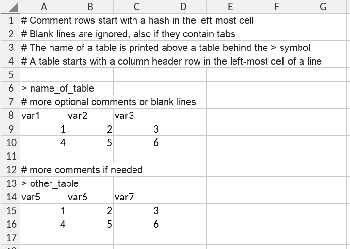

<!-- badges: start -->
  [](https://github.com/SystemsBioinformatics/dataSheetParcr/actions/workflows/R-CMD-check.yaml)
<!-- badges: end -->

# dataSheetParcr

A small R package that contains a parser for data sheets. It is currently used to parse our google sheets with the BioSB curriculum. The parser was constructed with the [`parcr`](https://CRAN.R-project.org/package=parcr) package

## Installation

Install with

``` r
# install.packages("pak")
pak::pak("SystemsBioinformatics/dataSheetParcr")
```

## Usage

The package exports only one function: `parse_sheet()`, which parses one sheet and returns a list of named tables. The structure of a data sheet should be as follows



This sheet will be parsed by `parse_sheet()` and returns a list object with two named `tibble` objects:

```         
$name_of_table
# A tibble: 2 × 3
  var1  var2  var3 
  <chr> <chr> <chr>
1 1     2     3    
2 4     5     6    

$other_table
# A tibble: 2 × 3
  var5  var6  var7 
  <chr> <chr> <chr>
1 1     2     3    
2 4     5     6    
```
